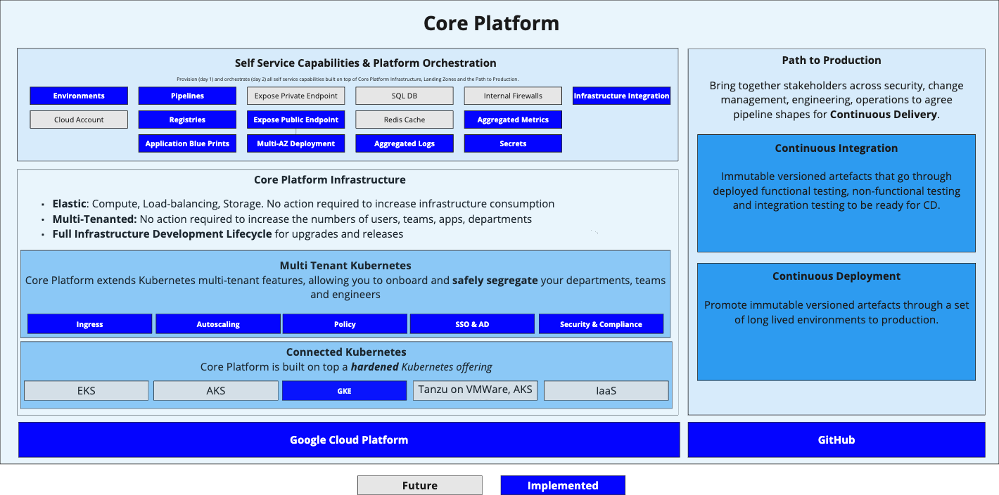
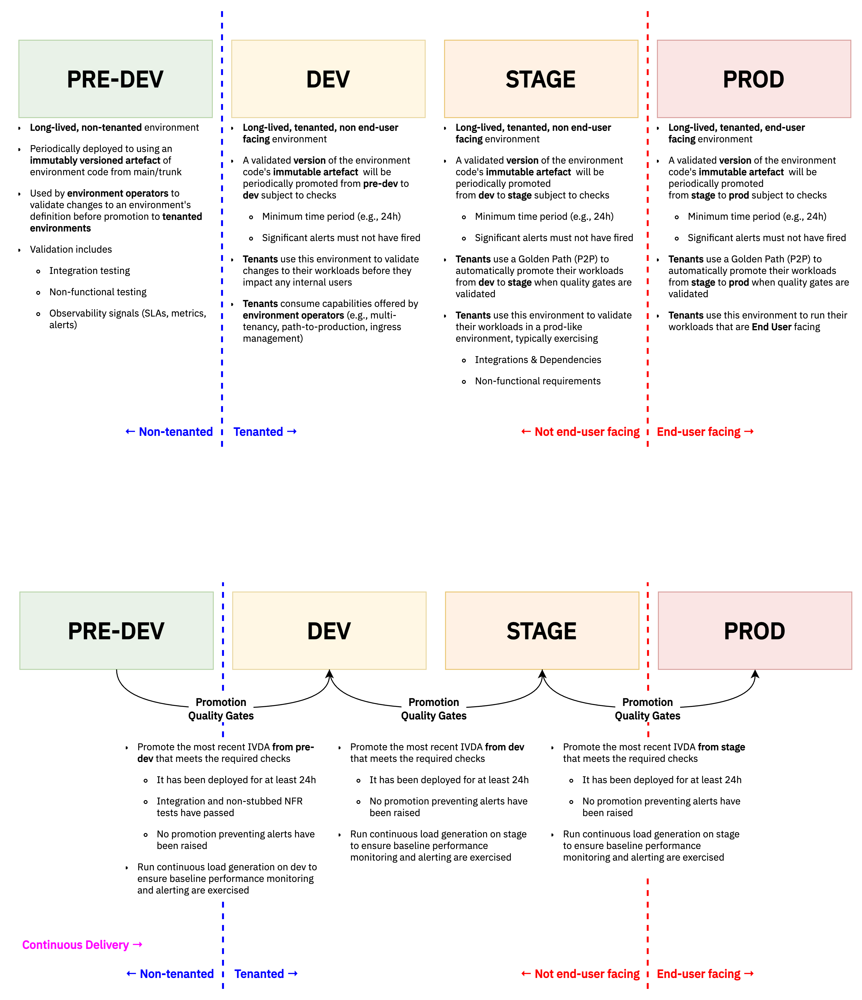

+++
title = "Capabilities & Roadmap"
weight = 99
chapter = false
pre = ""
+++

Core Platform is your ultimate all-in-one developer platform designed to turbocharge your software development journey from Day 1

See capabilities relevant to your role:

* [Platform Operator](#platform-operator-capabilities)
* [Application Developer](#application-developer-capabilities)

## Application Developer Capabilities

A developer capability is one that engineers can do for themselves without the need
to coordinate with infrastructure teams.

* [Environments as a service](#full-application-environments)
* [Pipelines as a service](#pipelines)
* [Registries as a service](#oci-registries-as-a-service)
* [Application Blue Prints](#application-blueprints)
* [Aggregated Monitoring](#aggregated-monitoring)
* [Hosted Dashboards](#hosted-dashboards)
* [Integrate with Cloud Infrastructure](#access-infrastructure)

### Full Application Environments

* Self-service request for a full set of environments for a new service
* Get additional environments for an existing service e.g. to do additional testing

See:

* [Tenancy](/app/tenancy/) for how to onboard onto the platform and get environments

### Pipelines

* Continuous Delivery ready pipelines come out of the box with stages for all types of testing
and promotion through environments all the way to production.
* Passwordless authentication from pipelines into environments

See:

* [Deploying an app](/app/)
* [Path to Production](/p2p/) for reference on each stage of the path to production
* [New application](/app/new-app/) for **automatic** repo, pipeline and app templating

### OCI Registries as a service

* Environments come with highly available registries local to each environment

### Exposing a service (TLS)

* Self-service ability to expose services to the Internet with automatic TLS.

### Application blueprints

* New application in seconds with built-in templates for key languages
* Ability to define your own templates for your engineering organisation.

See:

* [Templates](/reference/software-templates/) for application blueprints

### Aggregated Monitoring

* Logs automatically collected for all your application instances and searchable in once place
* Key performance metrics collected out of the box and the ability to define custom metrics collection
* Ability to deploy a per tenant monitoring stack

See:

* [Application Monitoring](/app/app-monitoring)
* [Logs](/app/logs)

### Hosted dashboards

* Deploy dashboards as configuration and deploy them as part of the P2P

See:

* [Application Monitoring](/app/app-monitoring/)

### Secure Secrets

* Ability to deploy secrets to all environments and access from your application

See:

* [Configuration](/app/configuration/#sensitive-configuration)

### Access infrastructure

* Provision infrastructure, e.g. cloud databases and caches, and connect securely from the platform

See:

* [Accessing Cloud Infrastructure](/reference/accessing-cloud-infra/)

## Platform Operator Capabilities

### Full Infrastructure Environments

A full set of environments to reliably deploy new versions of the platform without affecting
application developers (tenants).

### Fully Private Infrastructure

* All infrastructure is private with CLI for creating a encrypted tunnel to connect to from workstations
