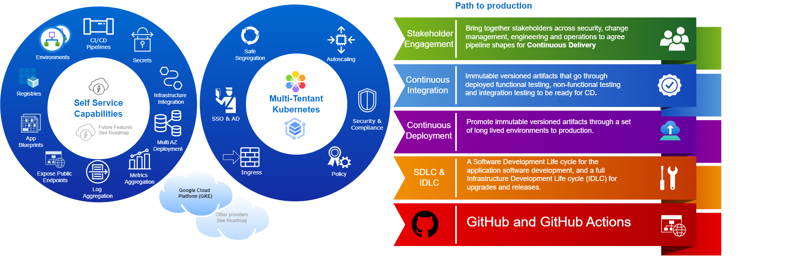

+++
title = "Capabilities & Roadmap"
weight = 1
chapter = false
pre = ""
+++

Core Platform is your ultimate all-in-one developer platform designed to turbocharge your software development journey from Day 1. The Core Platform creates self-service infrastructure for application development and deployment based on Kubernetes in a cloud platform.

Create a new application from a blueprint and have provisioned infrastructure in all existing environments, and a full path to production SDLC with CI/CD pipelines __in minutes__.

The core platform infrastructure is elastic, expanding to meet your requirements and reducing to minimise costs with no work required from infrastructure teams.

The core platform is multi-tenanted, which allows for the most efficient possible use of resources, minimising costs, with no action required to increase the number of users, apps and teams/departments. The core platform extends Kubernetes multi-tenant features allowing safe segregation across teams/departments and engineers/apps.

For future features see [Roadmap](roadmap.md)

See capabilities relevant to your role:
* [Application Developer](#application-developer-capabilities)
* [Platform Operator](#platform-operator-capabilities)

## Application Developer Capabilities

Developer capabilities are self-service - no need to coordinate with infrastructure teams.

### Full Application Environments

* Self-service request for a full set of environments for a new service
* Get additional environments for an existing service e.g. to do additional testing

See:
* [Tenancy](/app/tenancy/) for how to onboard onto the platform and get environments

### Pipelines

* Continuous Delivery ready pipelines come out of the box with stages for all types of testing 
and promotion through environments all the way to production.
* Passwordless authentication from pipelines into environments

See: 
* [Deploying an app](/app/)
* [Path to Production](/p2p/) for reference on each stage of the path to production 
* [New application](/app/new-app/) for **automatic** repo, pipeline and app templating
* [Repo structure](/app/repo-structure/) for how to layout your repo 

### OCI Registries as a service

* Environments come with highly available registries local to each environment

### Exposing a service (TLS)

* Self-service ability to expose services to the Internet with automatic TLS.

### Application blueprints

* New application in seconds with built-in templates for key languages 
* Ability to define your own templates for your engineering organisation.
 
See:
* [Templates](/app/software-templates/) for application blueprints
 
### Aggregated Monitoring

* Logs automatically collected for all your application instances and searchable in once place 
* Key performance metrics collected out of the box and the ability to define custom metrics
* Ability to deploy a per-tenant monitoring stack

See:
* [Application Monitoring](/app/app-monitoring)
* [Logs](/app/logs)

### Hosted dashboards

* Deploy dashboards as configuration and deploy them as part of the P2P

See:
* [Application Monitoring](/app/app-monitoring/)
 
### Secure Secrets

* Ability to deploy secrets to all environments and access from your application
* Extendable so you can orchestrate secrets into environments from your secrets store

See:
* [Secret Management](/app/secret-management/)

### Access infrastructure

* Provision infrastructure, e.g. cloud databases and caches, and connect securely from the platform

See: 
* [Accessing Cloud Infrastructure](/app/accessing-cloud-infra/)
* [Accessing Private Service Access](/app/accessing-psa/)

## Platform Operator Capabilities

### Full Infrastructure Environments

### Fully Private Infrastructure

* All infrastructure is private with CLI for creating a encrypted tunnel to connect to from workstations

