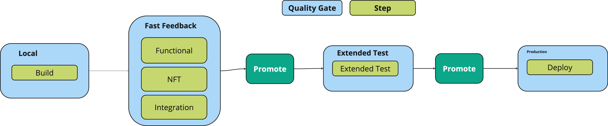

+++
title = "Path to Production"
weight = 10
chapter = false
pre = ""
+++

## Core Platform P2P

The common P2P enables you to focus on building your business logic and tests without
wasting time on CI/CD tooling setup.
All your custom logic should be added to your Makefile rather than directly in GitHub actions.

### Pipeline as a contract

* The P2P is the contract that every application agrees to adhere to for continuous delivery
* It is *light touch* in that it doesn't mandate many steps, just the most important types of testing
  * You can use whatever tools you want from each step



## Quality Gates

The P2P consists of the following quality gates:

* Local: What you can do on the local build agent. The output of the local quality gate is a versioned, immutable artifact.
  * Unit tests
  * Static verification
* Fast Feedback: What you can do in a few minutes
  * Deployed stubbed tests
* Extended Tests
* Once a version has been promoted from Extended tests it is ready for production

Two key concepts for the P2P are:

* [Versioning](./versioning): The P2P promoted an immutable, versioned artifact through the pipeline
* [Promotion](./promotion): Each time a quality gate is passed the immutable, versioned artifact is promoted

## Automatic GH Action authentication

As part of your [tenancy](../../app/tenancy) you define GitHub repos.

All of those repos get passwordless access to deploy to your namespaces and
any sub namespace you create.

### Requirements

In order to use this pipeline, you'll need to be a tenant of a Core Platform.

For any repo that wasn't created out of Core Platform templates, but you would like to follow a recommended p2p standard, please use [`corectl`](../corectl) as below:

```shell
corectl p2p env sync <app repository> <tenant> [flags]
```

If the repo was created by `corectl`, it will automatically set the required variables.

Having these, you're set to start deploying!

### How to use?

If you've started from a skeleton app the P2P is already set up for you.

If you're adding it to an existing repo, see [deployment frequency](./deployment-frequency) for how to set up the GitHub actions P2P.

Read more details about each step:

* [Fast Feedback](./fast-feedback)
* [Extended Test](./extended-test)
* [Prod Deployment](./prod)

### Makefile

The pipelines assume you have a Makefile and that in that Makefile you have the following tasks:

```makefile
.PHONY: p2p-build 
p2p-build: ## Build phase
    echo "##### EXECUTING P2P-BUILD #####"

.PHONY: p2p-functional 
p2p-functional: ## Execute functional tests
    echo "##### EXECUTING P2P-FUNCTIONAL #####"

.PHONY: p2p-nft
p2p-nft:  ## Execute non-functional tests
    echo "##### EXECUTING P2P-NFT #####"

.PHONY: p2p-integration
p2p-integration:  ## Execute integration tests
    echo "##### EXECUTING P2P-INTEGRATION #####"

.PHONY: p2p-extended-test
p2p-extended-test: ## Runs extended tests
    echo "##### EXECUTING P2P-EXTENDED-TEST #####"

.PHONY: p2p-prod
p2p-prod: ## Runs the service
    echo "##### EXECUTING P2P-PROD #####"

.PHONY: p2p-promote-to-extended-test
p2p-promote-to-extended-test: ## Promote service to extended test
    echo "##### EXECUTING P2P-PROMOTE-TO-EXTENDED-TEST #####"

.PHONY: p2p-promote-to-prod
p2p-promote-to-prod:  ## Promote service to prod
    echo "##### EXECUTING P2P-PROMOTE-TO-PROD #####"
```

These will be the entrypoints of the pipeline. You can then extend these to do your custom actions.

What tool you use in each of the Makefile targets is up to you.

### GitHub Variables

P2P pipelines expect some GitHub Variables to be configured.
You can configure it either automatically using `corectl` or manually.

#### Automatically

You can automatically set/update variables using `corectl`:

```bash
corectl p2p env sync <app-repository> <tenant-name>
```

#### Manually

Create your environments with the following variables:

* `BASE_DOMAIN` e.g. `gcp-dev.cecg.platform.cecg.io`
* `INTERNAL_SERVICES_DOMAIN` e.g. `gcp-dev-internal.cecg.platform.cecg.io`
* `DPLATFORM` environment name from platform-environments e.g. `dev`
* `PROJECT_ID` project id from platform environments e.g. `core-platform-efb3c84c`
* `PROJECT_NUMBER` project number for the project id above



Usually you need at least two environments, e.g.

* `dev`
* `prod`

For an instance of the CECG Core Platform on GCP.

A single dev environment is enough for Fast Feedback.

Set the following repository variables (these may be set globally for your org):

* `FAST_FEEDBACK` to `{"include": [{"deploy_env": "dev"}]}`
* `EXTENDED_TEST` to `{"include": [{"deploy_env": "dev"}]}`
* `PROD` to `{"include": [{"deploy_env": "prod"}]}`

And specifically for your app set:

* `TENANT_NAME` as configured in your tenancy in platform environments
